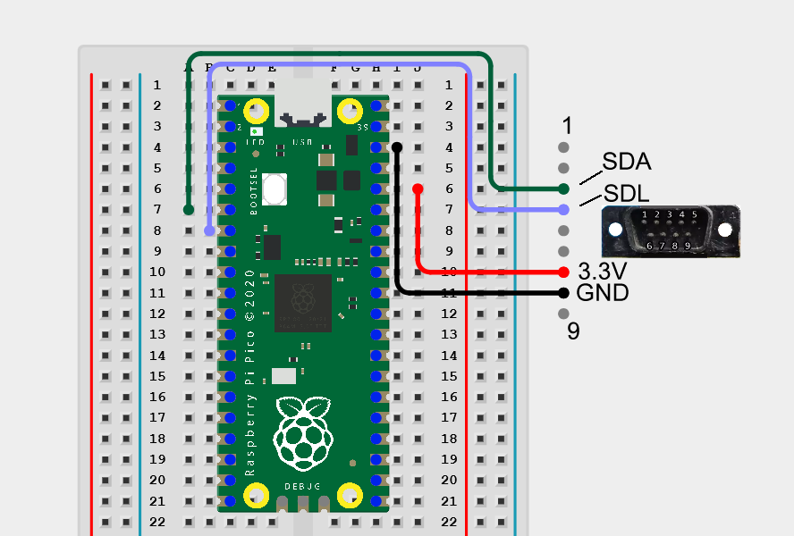

# pico-bridge

Firmware for the Raspberry Pi Pico (RP2040) that sits between the SaveKey Plus and the host running SaveKey-Manager.

Acts purely as a USB ↔ I²C bridge: it executes block-level read/write commands sent by the app and talks I²C to the SaveKey's EEPROM(s). It has no knowledge of the SaveKey allocation-list format or the TinyELF Basic filesystem — all layout/format logic lives in [artifacts/eeprom-explorer](../../artifacts/eeprom-explorer).

Not part of the pnpm workspace — this is a plain Pico SDK / CMake project (C), unrelated to the Node toolchain used elsewhere in this repo.

## Prototype wiring

I2C0 on the Pico's physical header pins 6/7, which are GPIO4 (SDA) and GPIO5 (SCL) — not GPIO6/GPIO7 (physical pin number ≠ GPIO number; that mix-up cost a long debugging session). Plus 3.3V and GND to the SaveKey Plus. See [src/i2c_bus.h](src/i2c_bus.h) if these ever change.



Full interactive schematic/breadboard view: [Cirkit Designer project](https://app.cirkitdesigner.com/project/4d5ff67b-dfd0-4421-9f80-2ef89a3df386).

## Status

- [x] I²C driver: init, probe, write, read ([src/i2c_bus.c](src/i2c_bus.c))
- [x] Desktop/browser-side transport: **CDC over Web Serial** (decided 2026-09-09)
- [x] USB command protocol ([src/command.c](src/command.c)): PING / SCAN / READ / WRITE, see below. `main.c` no longer free-runs a scan loop — it just waits for commands now.

### Command protocol

Text command lines (newline-terminated) over the USB CDC port; binary payload bytes for READ/WRITE data (no encoding overhead, and payload contents aren't meant to be eyeballed anyway — only the command/response lines are).

- `PING` → `OK pico-bridge`
- `SCAN` → zero or more `ACK <addr_hex2>` lines (only for addresses that ACK), then `OK`
- `READ <addr_hex2> <memaddr_hex4> <len_dec>` → `OK <len_dec>` immediately followed by exactly `len` raw bytes, or `ERR <reason>` (no data) if the request itself is invalid. `len` is only bounded by the 16-bit address space (up to 65536 bytes in one call) — reads aren't page-limited. A mid-stream I2C failure (rare, only possible once the address has already ACKed) pads the remainder with zero bytes rather than aborting, since the byte count was already committed via the `OK` header.
- `WRITE <addr_hex2> <memaddr_hex4> <len_dec>` then exactly `len` raw bytes from the host → `OK` or `ERR <reason>`. `len` is capped to `I2C_BUS_MAX_PAYLOAD` (256 bytes, one EEPROM page) — a multi-page write is several WRITE commands, one per page; the host is responsible for that chunking (this firmware deliberately doesn't do multi-page writes itself). `OK` is a genuine "safe to proceed" guarantee: the firmware polls the address (ACK-polling, capped at `WRITE_CYCLE_POLL_TIMEOUT_MS` = 20ms) until the EEPROM acknowledges again before responding, so the host never has to know or guess about the chip's internal write-cycle time. Confirmed on real hardware: an immediate READ right after a WRITE, with no host-side delay, correctly returns the just-written bytes — without the polling, the same test read back all zeros (the EEPROM was still mid-write-cycle and NACKed).
- Anything else → `ERR unknown command`

**Known simplification:** an out-of-range WRITE length is rejected without draining the (non-existent, per the client's own bug) payload bytes from the stream — this assumes a single well-behaved client (this repo's own PWA) that will simply never send a bad length. A different/misbehaving client could desync the command stream this way; there's no other client today, so this wasn't hardened further.

**Fixed bug (2026-09-10):** the pico-sdk's stdio has CRLF "convenience" translation on by default (`PICO_STDIO_ENABLE_CRLF_SUPPORT`), and it applies to *every* stdout write indiscriminately — including this firmware's raw binary READ responses (`fwrite()` in `command.c`, which routes through the same `_write()`/`stdio_put_string()` path as `printf`). A literal `0x0A` byte anywhere in that binary data (e.g. a directory entry's sector number happening to have `0x0A` as its low byte) silently became `0x0D 0x0A`, inserting an extra byte and desyncing everything the host read afterwards — this is what caused corrupted-looking directory entries and crashes when the app tried to use the garbage sector numbers that resulted. Confirmed directly on hardware with a raw byte round-trip test. Fixed in `main.c` with `stdio_set_translate_crlf(&stdio_usb, false)` right after `stdio_init_all()`.

### CDC vs HID — decided: CDC

Went with CDC/Web Serial, not HID, once the walking-skeleton test (see `artifacts/eeprom-explorer/src/lib/pico-bridge.ts`) proved it out on real hardware: connected fine, and correctly told apart the SaveKey Plus's two devices (0x50 + 0x54-0x57) from a normal single-EEPROM SaveKey after hotplugging. Deciding factor: CDC keeps debugging easy (any terminal program can watch the bring-up output directly), and the earlier concern about Web Serial being Chromium-only turned out to be a wash anyway — WebHID had the exact same restriction, so it bought nothing there. HID's zero-driver-install advantage stayed theoretical; CDC's debuggability is real and already paying off.

**Update (2026-09):** Firefox 151 (May 2026) added Web Serial support on desktop, ending the Chromium-only restriction — Web Serial is no longer a browser-support argument against CDC at all. (Safari still doesn't support it; Firefox's mobile/Android status wasn't announced.) The app already uses plain feature detection (`'serial' in navigator`), not a Chromium allowlist, so this needed no code change — Firefox users just start working once they're on 151+.

## Building

Easiest path: install the **"Raspberry Pi Pico"** extension in VS Code — it offers to install the SDK and toolchain for you, then "Compile" / "Run" build and flash this project directly (open this `firmware/pico-bridge` folder as the project root).

Manual CLI build (requires the [pico-sdk](https://github.com/raspberrypi/pico-sdk) and an `arm-none-eabi` toolchain installed separately):

```
export PICO_SDK_PATH=/path/to/pico-sdk   # or PowerShell: $env:PICO_SDK_PATH = "..."
mkdir build && cd build
cmake -G Ninja ..
ninja
```

This produces `build/pico_bridge.uf2`. Hold the Pico's BOOTSEL button while plugging it in (it mounts as a USB mass-storage drive), then copy `pico_bridge.uf2` onto it — it flashes and reboots automatically.

To try the command protocol by hand, open the Pico's USB serial port (any baud rate — it's a virtual CDC port, not real UART) in a terminal program (PuTTY, `screen`, the Arduino IDE's Serial Monitor, etc.) and type e.g. `PING` or `SCAN`, followed by Enter.
